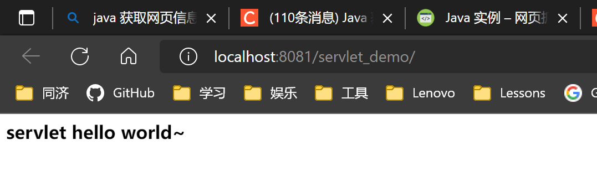
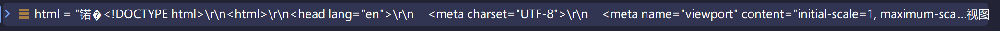

第一次写java_socket
最基础的版本，并未使用tomcat，而是直接调用ServerSocket
别问，问就是黑马程序员，成就it hei~ma~

# java_socket知识笔记

## 0 java究竟有几种方式发http请求

> https://blog.csdn.net/m0_47562115/article/details/118325354

- 第1种：HttpURLConnection、
- 第2种：URLConnection、
- 第3种：HttpClient、
  - HttpClient常用HttpGet和HttpPost这两个类，分别对应Get方式和Post方式。
    使用DefaultHttpClient类的execute方法发送HttpGet和HttpPost这两个类的请求，并返回HttpResponse对象
  - 需要依赖于三个jar包，
    分别是：apache-httpcomponents-httpclient.jar、 commons-logging-1.0.4.jar、httpcore-4.1.1.jar。
- 第4种：Socket，比较麻烦


## 1Server服务器端
### 1.1- ServerSocket 多线程处理连接
accept 方法，在未接受到连接请求时阻塞，连接成功后
getRemoteSocketAddress()返回此套接字连接的端点的地址，如果未连接则返回 null
每次连接都创建一个新的线程去处理，就可以处理多个连接了
```java
ServerSocket ss = new ServerSocket(8080); // 监听指定端口
System.out.println("server is running...");
while (true){
    Socket sock = ss.accept();
    System.out.println("connected from " + sock.getRemoteSocketAddress());
    Thread t = new Handler(sock);
    t.start();
}
```

### 1.2- 数据流处理 Input和OutputStream

> 对InputSteam和OutputStream的详解
> https://www.liaoxuefeng.com/wiki/1252599548343744/1298069163343905

**流程**

输入输出流
```java
InputStream input = this.sock.getInputStream()
OutputStream output = this.sock.getOutputStream()
```
缓冲区
```java
BufferedReader reader = new BufferedReader(new InputStreamReader(input, StandardCharsets.UTF_8));
BufferedWriter writer = new BufferedWriter(new OutputStreamWriter(output, StandardCharsets.UTF_8));
```
reader和writer

- 循环，一行一行读入
```java
for (;;) {
    String header = reader.readLine();
    if (header.isEmpty()) { // 读取到空行时, HTTP Header读取完毕
        break;
    }
    System.out.println(header);
}
```
- 将html文件通过http协议的形式发出
```java
//读取html文件，转换为字符串
BufferedReader br = new BufferedReader(new FileReader("http/html/a.html"));
StringBuilder data = new StringBuilder();
String line = null;
while ((line = br.readLine()) != null){
    data.append(line);
}
br.close();
int length = data.toString().getBytes(StandardCharsets.UTF_8).length;

writer.write("HTTP/1.1 200 OK\r\n");
writer.write("Connection: keep-alive\r\n");
writer.write("Content-Type: text/html\r\n");
writer.write("Content-Length: " + length + "\r\n");
writer.write("\r\n"); // 空行标识Header和Body的分隔
writer.write(data.toString());
writer.flush();
```

### 1.3- 内网穿透：将web服务器公开到Internet
使用cpolar（之前远程桌面使用过，不多提了），此处使用的是http服务器功能
> 见如下链接   1.3-将web服务器公开到Internet
> https://www.cpolar.com/docs

输入
```shell
cpolar http 8080
```
显示如下
```shell
cpolar by @bestexpresser                                                                                (Ctrl+C to quit)                                                                                                                        Tunnel Status       online
Account             QiQi (Plan: Free)
Version             2.92/2.96
Web Interface       127.0.0.1:4042
Forwarding          http://44ad009e.cpolar.top -> http://localhost:8080
Forwarding          https://44ad009e.cpolar.top -> http://localhost:8080
# Conn              0
Avg Conn Time       0.00ms         
```
点击其中的网址 http://44ad009e.cpolar.top 即可

## 2 Client端

### 2.1 呃，老师给的，其实我不太懂，只是跑通了
运行tomcat_servlet项目, index.jsp部署在localhost:8081/servlet_demo/

代码如下，注意deGet中的localhost，port，page的调用
```java
import java.io.BufferedReader;
import java.io.InputStreamReader;
import java.io.PrintWriter;
import java.net.Socket;
import java.nio.charset.StandardCharsets;

public class HTTPClient {
    private String webServer="localhost";
    private int port=8081;
    private String page="index.html";
    private Socket serviceSocket;
    private PrintWriter out;
    private BufferedReader in;

    /**
     * @param args
     */
    public static void main(String[] args) {
        HTTPClient client = new HTTPClient("localhost","/servlet_demo/");
        client.doGet();
    }
    public HTTPClient(String server,String p){
        this.webServer=server;
        this.page=p;
    }

    public void doGet() {
        try {
            String httpRequest = "GET /"+page+" HTTP/1.1\r\n";
            httpRequest = httpRequest
                    + "Accept: application/x-ms-application, image/jpeg, application/xaml+xml, image/gif, image/pjpeg, application/x-ms-xbap, application/vnd.ms-excel, application/vnd.ms-powerpoint, application/msword, */*\r\n";
            httpRequest = httpRequest + "Accept-Language: zh-CN\r\n";
            httpRequest = httpRequest
                    + "User-Agent: Mozilla/4.0 (compatible; MSIE 7.0; Windows NT 6.1; WOW64; Trident/4.0; SLCC2; .NET CLR 2.0.50727; .NET CLR 3.5.30729; .NET CLR 3.0.30729; Media Center PC 6.0; .NET4.0C; .NET4.0E)\r\n";
            httpRequest = httpRequest + "Accept-Encoding: gzip, deflate\r\n";
            httpRequest = httpRequest + "Host: "+this.webServer+":"+port+"\r\n";
            httpRequest = httpRequest + "Connection: Keep-Alive\r\n\r\n";

            // Open a Socket
            serviceSocket = new Socket(webServer, port);
            if (serviceSocket != null) {
                // transfer message with socket
                out = new PrintWriter(serviceSocket.getOutputStream());
                out.println(httpRequest);
                out.flush();

                in = new BufferedReader(new InputStreamReader(serviceSocket.getInputStream(), StandardCharsets.UTF_8));

                System.out.println("Connection is  Success");
                
                System.out.println("--  HTTP Response  ------------------");
                String str = null;
                while (null != (str = in.readLine())) {
                    System.out.println(str);
                }
            }

        } catch (Exception e) {
            System.out.println(e);
        }

    }

}


```

```http request
Connection is  Success
--  HTTP Response  ------------------
HTTP/1.1 200 
Set-Cookie: JSESSIONID=E0FE20D53A777C399E7D6DD4094F1182; Path=/servlet_demo; HttpOnly
Content-Type: text/html;charset=UTF-8
Content-Length: 60
Date: Mon, 26 Sep 2022 10:25:41 GMT
Keep-Alive: timeout=20
Connection: keep-alive

<html>
<body>
<h2>servlet hello world~</h2>
</body>
</html>
```

### 2.2 Java实现用HttpClient来获取网页内容

这次我构建了maven，因为要引入依赖（maven会引入了，别的方法已经有点忘了，我已经是没有maven就不会活的废物了

> https://blog.csdn.net/guihua55/article/details/108951768

使用CloseableHttpClient，爬取网页html内容，非常简单

```java
String html = EntityUtils.toString(response.getEntity(), "GBK");
```
获得的html是\r\n为换行符的整个html的字符串



就不自己写了，看这个就ok

### 2.3 socket与中文乱码

我以为我都设置成了utf_8呀，为啥有问题

好吧也许读取下来的数据本身有问题，与我无关，我改成gbk就对了

## 3 正则表达式

```html
如：
如果用正则匹配src中内容非懒惰模式匹配
src=".*"
匹配结果是：src="test.jpg" width="60px" height="80px"
意思是从="往后匹配，直到最后一个"匹配结束
. 表示 匹配除换行符 \n 之外的任何单字符，*表示零次或多次。所以.*在一起就表示任意字符出现零次或多次。

懒惰模式正则：
src=".*?"
结果：src="test.jpg"
因为匹配到第一个"就结束了一次匹配。不会继续向后匹配。因为他懒惰嘛。

.表示除\n之外的任意字符
*表示匹配0-无穷
```