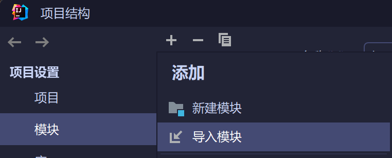
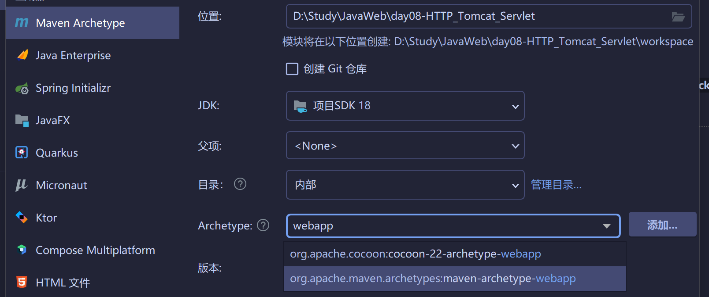
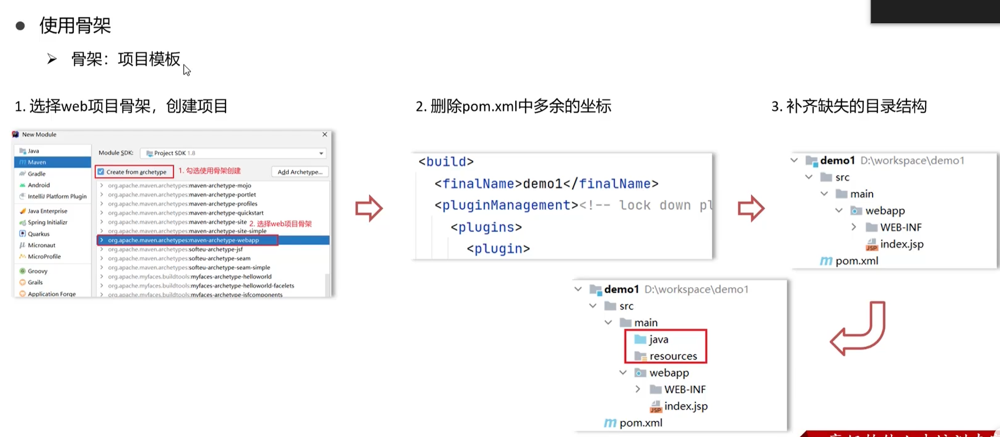
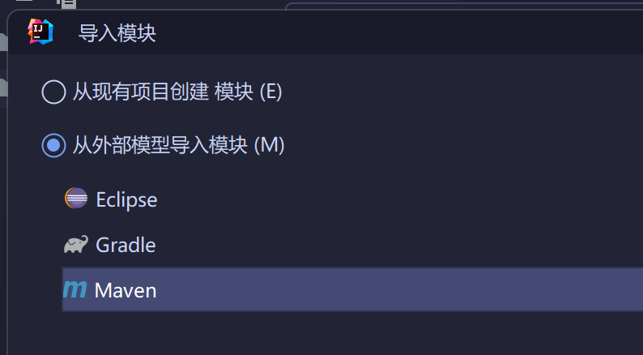
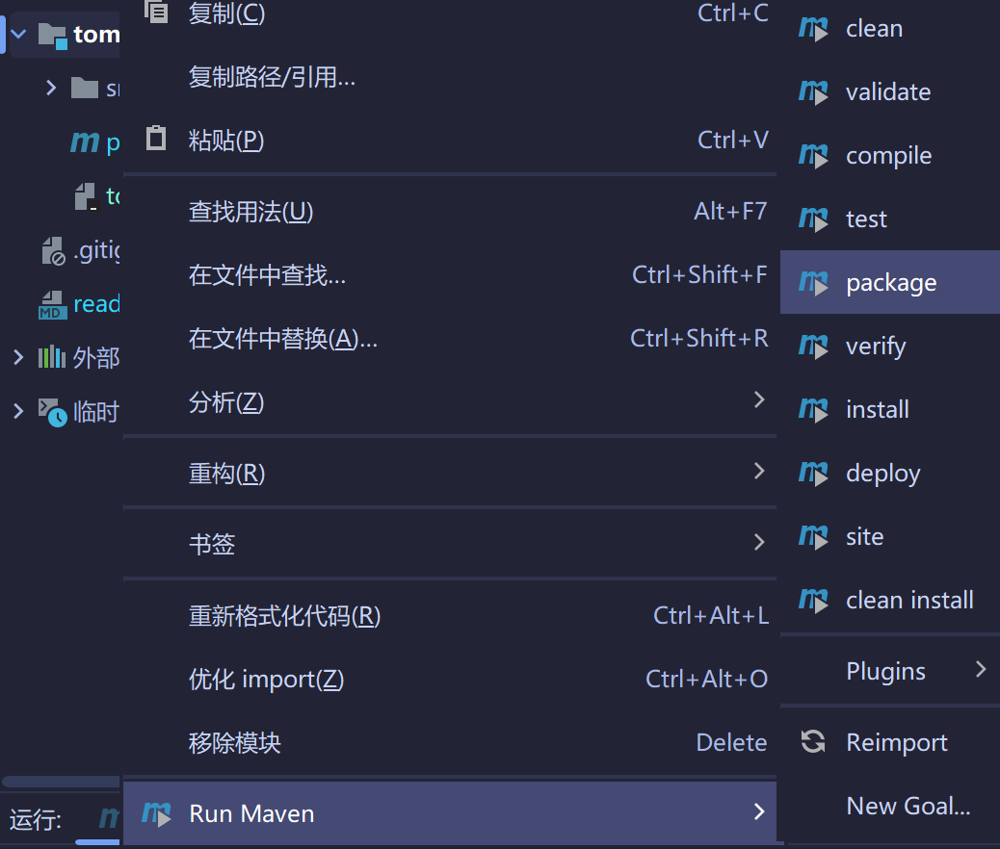
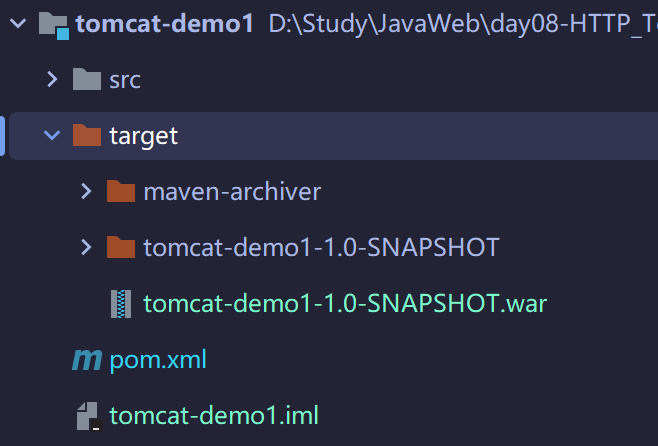
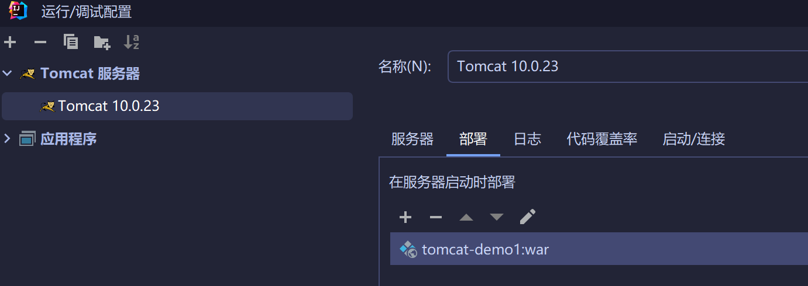
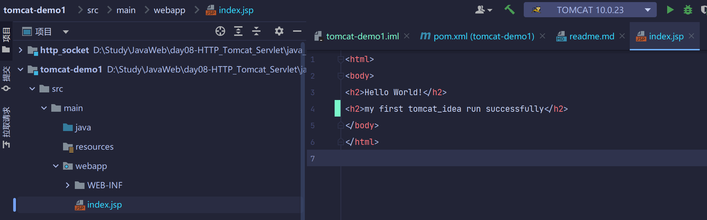
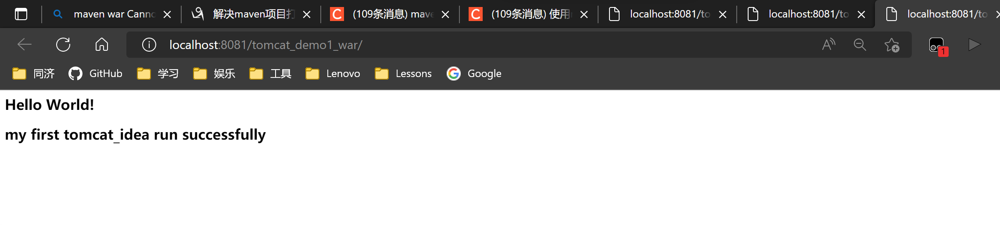

# 关于项目构建

project structure -> 新建或者导入



选择maven，webapp骨架的第二个


## 总体流程如下


## 2 tomcat_web

### 2.1 maven项目导入


### 2.2 打war包


报错
```shell
Cannot access defaults field of Properties
```
在pom.xmlproject下加入
```xml
  <build>
    <plugins>
      <plugin>
        <groupId>org.apache.maven.plugins</groupId>
        <artifactId>maven-war-plugin</artifactId>
        <version>3.2.2</version>
      </plugin>
    </plugins>
  </build>
```
成功打包


### 2.3tomcat构建项目


页面

成功跑起来
